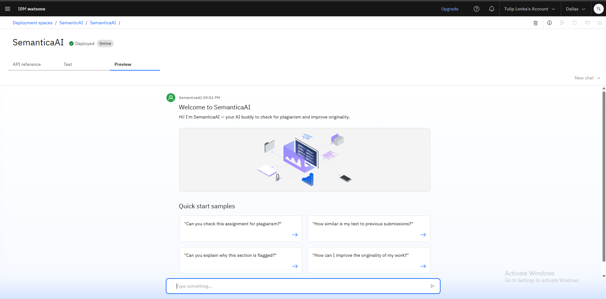

# 🧠 SemanticaAI – Plagiarism Checker

SemanticaAI is an AI-powered plagiarism detection agent developed using **IBM Watsonx Assistant** and **Granite Model**, hosted via **IBM Cloud**. It goes beyond surface-level checks by identifying **semantic plagiarism** — paraphrased or restructured text with similar meaning.

---

## 🔍 Features

- Detects semantic-level plagiarism, not just copy-paste
- Highlights suspected sentences/phrases
- Calculates originality score
- Offers rephrasing tips to improve writing quality

---

## 🛠️ How to Use
1. Clone the repository
2. Open the Jupyter Notebook `SemanticaAI_Pl.ipynb`
3. Follow the instructions in each cell

---

## 🛠️ Technologies Used

- IBM Watsonx Agent Lab
- IBM Cloud Granite Foundation Models
- LangGraph (ReAct architecture)
- JSON-based instruction + configuration files

---

## 📂 Files
- `SemanticaAI_Pl.ipynb` – Main project notebook
- `README.md` – Project overview
- `Interface.png` – UI Screenshot
---

## 💬 Demo Questions to Ask the Agent

- “Can you check this paragraph for plagiarism?”
- “How original is my writing?”
- “Is this text a paraphrased copy?”
- “Suggest edits to make this content plagiarism-free.”

---

## 📌 Project Status

✅ Completed and tested.  
📥 Currently deployed internally using IBM watsonx.

---

## 🔗 Live Demo (if applicable)

*Currently hosted via IBM Cloud – not publicly linked*

---

## 🙋‍♀️ Author

👤 Tulip Lenka   
🎓 BTech in Odisha University of Technology and Research ( Robotics and AI )  
🌐 [GitHub Profile](https://github.com/tulip1807)

